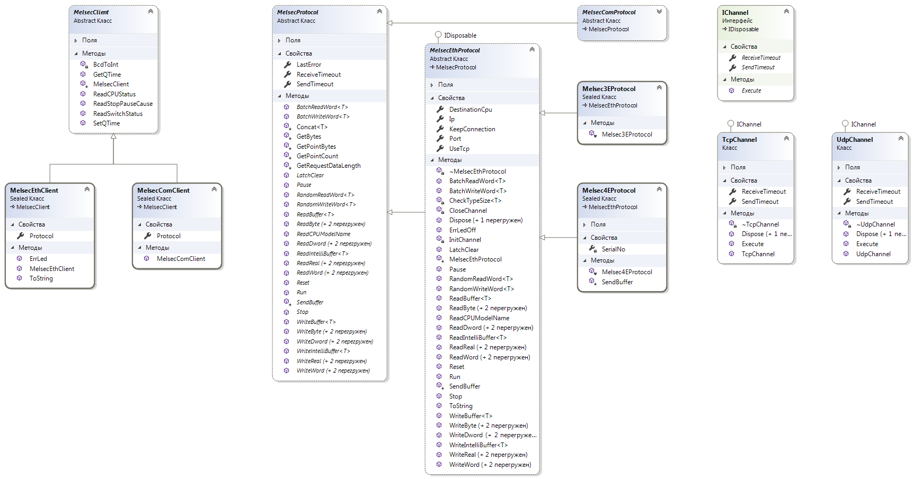

# Melsec client

***

Implementation Melsec communication protocol.
 
It usually uses for communication with factory automation systems based on Mitsubishi Melsec Q controllers.

***

### Class diagram

